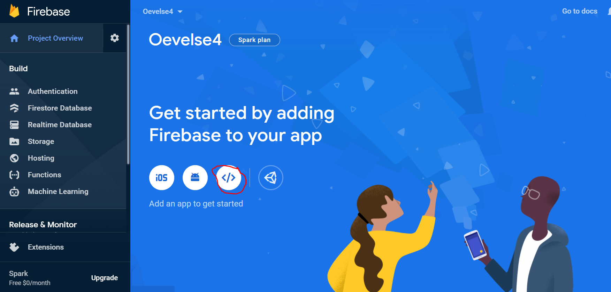
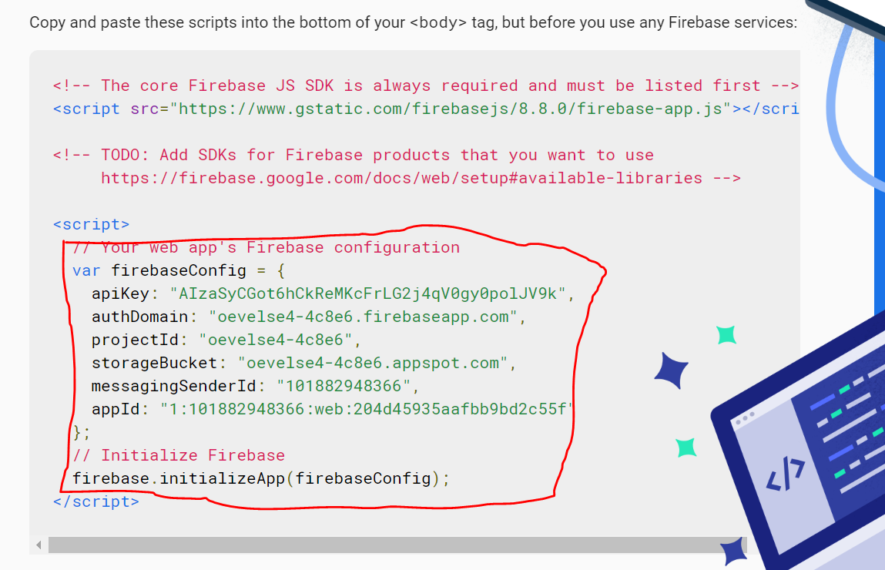
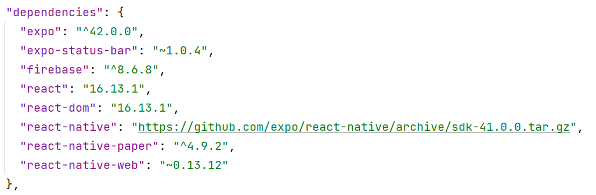

<h1> Øvelsesvejledning til øvelse 4 - Firebase </h1>

<h3> Integration med Firebase</h3>

1. Start med at oprette et nyt projekt. 
2. Installér følgende dependencies;
-   firebase
-   react-native-paper
   

    
             npm install --save firebase react-native-paper

3. Opret nu en firebase web app;
- Følg dette link: https://firebase.google.com/
- Tryk på "Get Started"
- Tryk på "Add Project"
- Giv projektet et vilkårligt navn og tryk "continue"
- Fjern Analytics og tryk "create project"
- Registrer nu en en web Aapplikation. Tryk på ikonet </> Se billeder herunder;

  
- Giv applikationen et vilkårligt navn og tryk "Register app".
- Du vil nu få præsenteret en kodeblok. Kopier den del, som omkranset af en rød boks på billedet herunder; 

  
- Tryk på "Authentication"
- Gå ind på Sign-in method
- Aktiver sign-in ved brug af Email/Password
  
4. Vend tilbage til dit IDE
- Omskriv App.js til en funktionel komponent. 
- Indsæt den kode, du har kopieret fra firebase. 
- Opret en components mappe og opret en js-fil i denne og kald filen "SignInForm"

<h3> SignInForm </h3>

HINT: Brug løbende den officielle docs:  https://docs.expo.io/guides/using-firebase/

1. Omskriv til en funktionel komponent 
2. importer firebase og useState
   - docs på state hook kan findes på følgende link: https://reactjs.org/docs/hooks-state.html
3. Initier const's til; email, password, isCompleted og errorMessage
4. i return() oprettes en overskrift og to inputfelter, som skal tage imod email og password samt en "create user" knap.
5. i onPress skal knappen aktivere en oprettelse af brugeren.
   - Opret derfor en metode til at oprette en bruger i firebase
      - HINT: https://firebase.google.com/docs/auth/web/password-auth.  
      - HUSK: Input felterne skal i onChangeText dynamisk sætte værdierne for email & password
6. Importer SignUpForm i App.js og placer siden i return()
7. Sørg for at din kode afprøver om en firebase app allerede er initialiseret, før selve initialiseringen opstår
   - HINT: https://dev.to/lxnd77/comment/13fbb
8. Start nu appen og opret en testbruger. F.eks. E-mail: "test@mail.dk"  password: 1234
- Gå ind Firebase -> Authentication -> Users og se se at din bruger nu er oprettet til i dit projekt. 

<h3> LoginForm </h3>

1. Opret en js-fil i components-mappen og omskriv til en funktionel komponent.
2. LoginForm er kodemæssigt næsten nøjagtig ens med SignUpForm. Kopier derfor al kode fra SignUpForm og placer i LogionForm 
- HUSK: Du skal justere overskriften på den komponent der skal eksporteres
3. Juster teksten på knappen fra at være "create user" til "login"
4. Dernæst skal knappen aktivere en login metode fremfor en sign-in metode.
- HINT: Firebase stiller en prædefineret metode tilrådighed ligesom med signInMetoden:  https://firebase.google.com/docs/reference/js/firebase.auth.Auth#signinwithemailandpassword

<h3> ProfileScreen </h3>

1. Opret en js.fil i components mappen ved navn "ProfileScreen".
2. Opret en tekstkomponent, der udskriver e-mailen på den bruger, som er logget ind. 
-  HINT: Led efter en metode i dokumentationen, som henter oplysninger på en aktiv bruger. 
3. Opret en log ud knap. Firebase stiller en log ud metode til rådighed. Find metoden i dokumentationen.

<h3> App.js </h3>

1. Vend tilbage til App.js og opret en metode, som monitorer om en bruger tilstand ændres fra inaktiv til aktiv
- HINT: Find hjælp på dette link: https://johnwcassidy.medium.com/firebase-authentication-hooks-and-context-d0e47395f402
- Dokumentionen på useEffect: https://reactjs.org/docs/hooks-effect.html
2. Afslutningsvis, skal return() i app.js på baggrund af brugerens tilstand fremvise enten LoginForm & SignInForm eller ProfileScreen

<h3> Færdig?</h3>

- Når du aktiverer app'en skal du indledningsvis få fremvist en side der indeholder både felter til login eller oprettelse af en bruger. 
- Ved at oprette en bruger eller login, skal appen automatisk føre dig ind til Profilescreen, hvor mailadressen på den aktive bruger fremvises. 
- Ved tryk på log-ud-knappen, skal appen føre dig tilbage til udgangspunktet.

<h3>Bilag</h3>

<h4>Bilag A - Package.json - Fra Endelig Løsning </h3>

